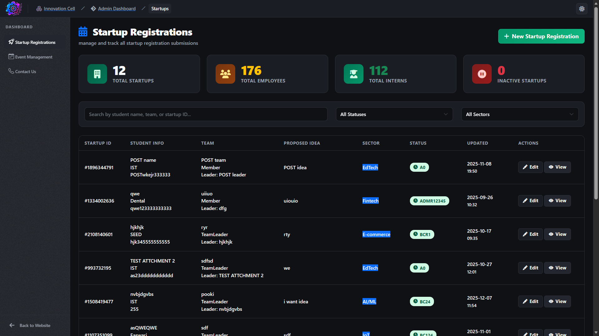
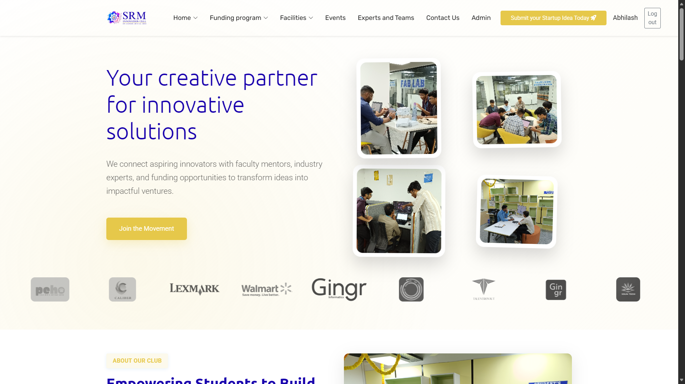

<!-- Coding GIF Header -->

# 🙏 Guten Tag ヾ(^▽^*)) I am Abhilash Pattnaik

### CRM/ERP Developer | Full Stack Engineer

## 🎯 Quick Stats

<table border="0" cellspacing="0" cellpadding="0">
<tr>
<td width="50%" valign="top">

 

**🚀 Current Focus**

 

> 🏢 **Project:** Innovation Cell's ERP  
> 👨‍💻 **Role:** Full Stack Developer  
> 🤝 **Looking For:** Hackathons & Startups  
> 💻 **Primary Stack:** .NET · Bootstrap · SQL

 

</td>

<td width="50%" valign="top">

### 🏆 Achievements

</td>
</tr>
</table>

## 💻 Tech Arsenal

<table border="0" cellspacing="0" cellpadding="15">
<tr>
<td align="center" valign="top">

**Frontend**

</td>
</tr>
<tr>
<td align="center" valign="top">

**Backend & Database**

</td>
</tr>
<tr>
<td align="center" valign="top">

**Mobile & Cloud**

</td>
</tr>
</table>

## 🎨 Featured Projects

<table border="0" cellspacing="0" cellpadding="20">
<tr>
<td width="33%" align="center" valign="top">

### 🏢 ERP System

**Enterprise Resource Planning**  
`C#` `ASP.NET` `SQL Server`

</td>
<td width="33%" align="center" valign="top">

### 📱 Mobile App

**Cross-Platform Solution**  
`Flutter` `Firebase` `Dart`

</td>
<td width="33%" align="center" valign="top">

### 🌐 Web Portal

**Full Stack Portal**  
`React` `Node.js` `MySQL`

</td>
</tr>
</table>

## 📊 GitHub Analytics

<table>
<tr>
<td>

</td>
</tr>

<tr>
<td align="center">

</td>
</tr>
</table>

### 💭 *ERPs, a Bajillion Commits Away...*

